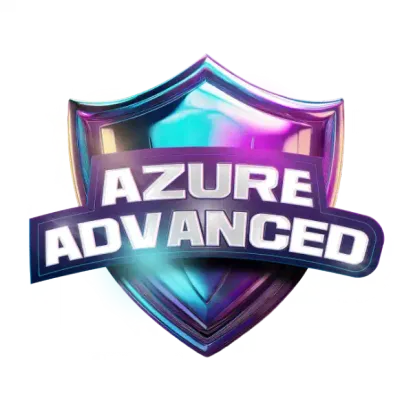

<h1> Bootcamp Microsoft Azure Advanced - AZ-900 </h1>

 

*Bootcamp* EAD oferecido pela *Digital Innovation One* (DIO), em parceria com a Microsoft. Esse curso tem como objetivo preparar profissionais para a certificação AZ-900, entendendo as melhores práticas de conteinerização para empacotar aplicações *serverless*, orquestrar e gerenciar soluções Azure em *cloud* em alto nível. Ao mesmo tempo em que se familiariza com a plataforma Microsoft Azure, o aluno se prepara para realizar o exame de certificação com sucesso.

 

**Início**: 27/10/2024 | **Término**: 09/12/2024

**Carga Horária**: 34 horas

 

## 📝 Atividades
 

**1. Introdução a computação em nuvem**

* Introdução ao Microsoft Azure Advanced ✔️
* Introdução a computação em nuvem ✔️
* Versionamento de código com Git e GitHub ✔️
* Desafios de projetos: crie um portfólio vencedor ✔️
* **Desafio**: Contribuindo em um projeto *Open Source* no GitHub ✔️

 
 

**2. Criando contêineres com Docker**
* *Overview* Docker ✔️ 
* Conhencendo e instalando o Docker ✔️ 
* Primeiros passos com o Docker ✔️ 
* Armazenamento de dados com Docker ✔️ 
* Processamento, logs e rede com Docker ✔️ 
* Definição e criação de um Docker File ✔️ 
* Trabalhando com Docker Compose ✔️ 
* **Desafio**: [Utilização prática no cenário de microsserviços]()
* **Desafio de código**: Explorando contêineres com lógica de programação ✔️
* Desafio de código: Aperfeiçoe sua lógica e pensamento computacional ✔️

 
 

**3. Orquestração de contêineres com Kubernetes**
* *Overview* Kubernetes ✔️
* Introdução a Kubernetes e orquestração de contêineres ✔️
* Ambiente de desenvolvimento Kubernetes ✔️
* *Cluster* Kubernetes em nuvem ✔️
* Conceitos básicos sobre pods em Kubernetes ✔️
* Serviços de acesso para Kubernetes Pods ✔️
* Persistência de dados em *clusters* Kubernetes ✔️
* **Desafio**: [Criando um *pipeline* de *deploy* de uma aplicação utilizando Gitlab, Docker e Kubernetes]()
* **Desafio de código**: Explorando Kubernetes com lógica de programação ✔️

 
 

**4. Introdução a aplicações *serverless***
* *Overview serverless* ✔️
* Azure API *Management Dashboard* ✔️
* Introdução a engenharia de dados na Azure ✔️
* Introdução aos conceitos de *serverless* e Azure *Functions* ✔️
* **Desafio**: [Trabalhando aplicações *serverless* na Azure]()

 
 

**5. Mentorias**
* *Live* de lançamento - *Bootcamp* Microsoft Azure Advanced - Felipe Aguiar e Alex Xavier ✔️
* Trabalhando com serviços de bancos de dados multimodelo com Azure Cosmos DB - Marcelo Fonseca ✔️
* Criando copilotos de IA generativa com Azure IA Studio - Rogério Rodrigues ✔️
* Criando soluções com IA generativa utilizando o Azure ML Prompt Flow - Alexsandro Lechner ✔️
* Trabalhando com GitHub Copilot para produtividade em desenvolvimento - Rogério Rodrigues ✔️

 
 

## 📌 Conteúdo extra 
 

* **Aula de revisão do John Savill**: [AZ-900 - Azure Fundamentals Certification Course *Playlist*](https://www.youtube.com/watch?v=pY0LnKiDwRA&list=PLlVtbbG169nED0_vMEniWBQjSoxTsBYS3&index=1)